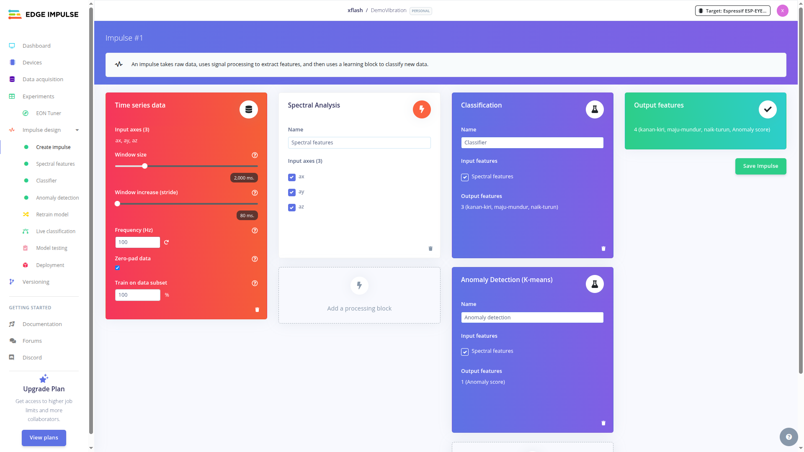
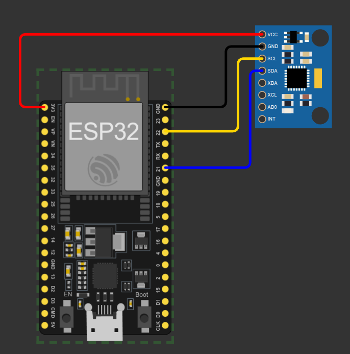

# Deteksi Anomali dari Getaran - Bagian 2: Inference App

Demo deteksi anomali getaran menggunakan platform **Edge Impulse**, board **ESP32 DevKit V1**, dan sensor accelerometer/gyro **MPU6050**.

> **Project ini bagian 2 dari 2.**
> Project ini menjalankan **model hasil training Edge Impulse langsung di ESP32** (on-device inference). Data getaran dibaca dari MPU6050, diklasifikasikan, lalu hasilnya ditampilkan lewat serial. Pengumpulan data ada di [project bagian 1](../VIBRATION_DATA_COLLECTOR).

## Cara Kerja

1. MPU6050 membaca percepatan sumbu X, Y, Z pada **100 Hz** (tiap 10 ms), satuan **m/s²** — sama seperti saat pengumpulan data.
2. ESP32 mengumpulkan **1 window = 200 sampel × 3 axis** (2 detik data).
3. Model Edge Impulse dijalankan di ESP32:
   - **Classification** — menebak jenis gerakan: diam, maju-mundur, naik-turun, kanan-kiri.
   - **Anomaly Detection (K-means)** — memberi *anomaly score*; skor tinggi = getaran di luar pola normal.
4. Hasil ditampilkan di serial (`115200`): bar probabilitas tiap label, gerakan terdeteksi, status NORMAL/ANOMALI, plus info debug (timing & pemakaian RAM).

## Model / Impulse

Model diambil dari impulse yang sama dengan bagian 1 (Time series → Spectral Analysis → Classification + Anomaly Detection K-means).



## Kebutuhan

- Board ESP32 DevKit V1
- Sensor MPU6050 (modul GY-521)
- Kabel jumper
- [PlatformIO](https://platformio.org/) (VS Code)

Library:

- **Edge Impulse Arduino library** hasil deployment — sudah diletakkan di [lib/DemoVibration_inferencing](lib/DemoVibration_inferencing)
- `Adafruit MPU6050` ^2.2.9 (otomatis ter-download via `lib_deps`)
- `Adafruit Unified Sensor` ^1.1.15 (otomatis ter-download via `lib_deps`)

> **Cara mendapatkan library inference:** buka project Edge Impulse → **Deployment** → pilih **Arduino library** → **Build** → unduh `.zip`, ekstrak isinya ke folder `lib/` project ini.
>
> Setiap kali label/model berubah (mis. menambah label **diam**), lakukan **retrain** lalu **redeploy** library. Kode firmware otomatis mengikuti jumlah label (`EI_CLASSIFIER_LABEL_COUNT`), jadi tidak perlu diubah.

## Diagram Wiring

Wiring sama persis dengan bagian 1. MPU6050 memakai antarmuka **I2C**.



```
   ESP32 DevKit V1              MPU6050 (GY-521)
   +--------------+             +--------------+
   |         3V3  |------------>| VCC          |
   |         GND  |------------>| GND          |
   |    GPIO21    |------------>| SDA          |
   |    GPIO22    |------------>| SCL          |
   +--------------+             +--------------+
```

| ESP32   | MPU6050 |
|---------|---------|
| 3V3     | VCC     |
| GND     | GND     |
| GPIO21  | SDA     |
| GPIO22  | SCL     |

> Catatan: gunakan **3V3**, bukan 5V.

## Cara Pakai

### 1. Upload Firmware

```bash
pio run --target upload
```

### 2. Buka Serial Monitor

```bash
pio device monitor
```

Contoh output tiap window:

```
========== HASIL DETEKSI ==========
  diam        |....................| 0.8%
  maju-mundur |###################.| 94.5%
  naik-turun  |#...................| 3.1%
  kanan-kiri  |....................| 1.6%
  -----------------------------------
  >> Gerakan : maju-mundur (94.5%)
  >> Status  : NORMAL  (anomaly 0.12)
  [debug] diam=0.00800  maju-mundur=0.94500  naik-turun=0.03100  kanan-kiri=0.01600  anomaly=0.12040
  [debug] timing -> DSP 3 ms | inferensi 5 ms | anomaly 1 ms
  [debug] RAM heap: terpakai 48120 / 342108 byte | free 293988 | maks terpakai 61540 byte
  [debug] free heap minimum: 280568 byte | sisa stack task min: 3120 byte
===================================
```

Interpretasi:

- **Bar + persentase** — probabilitas tiap label; bar makin panjang makin yakin.
- **>> Gerakan** — label dengan nilai tertinggi (gerakan yang terdeteksi).
- **>> Status** — `NORMAL` bila anomaly score ≤ ambang, `ANOMALI` bila di atas ambang (`ANOMALY_THRESHOLD`, default `0.3`).
- Baris **[debug]**:
  - nilai mentah tiap label + anomaly (5 desimal),
  - **timing** — waktu DSP, inferensi, dan anomaly (ms),
  - **RAM heap** — heap terpakai/total, sisa (free), dan **maks terpakai** (puncak RAM sejak boot),
  - **free heap minimum** — heap paling sedikit yang pernah tersisa, dan **sisa stack task min** — sisa stack paling kritis task loop.

> Nilai `ANOMALY_THRESHOLD` dan `BAR_WIDTH` bisa diubah di bagian atas [src/main.cpp](src/main.cpp).

## Struktur Project

```
VIBRATION_INFERENCE_APP/
├── platformio.ini                    # Konfigurasi board & serial
├── src/
│   └── main.cpp                      # Firmware baca MPU6050 + jalankan model
├── lib/
│   └── DemoVibration_inferencing/    # Library inference dari Edge Impulse
├── img/
│   ├── wiring.png                    # Diagram wiring
│   └── ei-impulse.png                # Konfigurasi impulse
└── README.md
```
